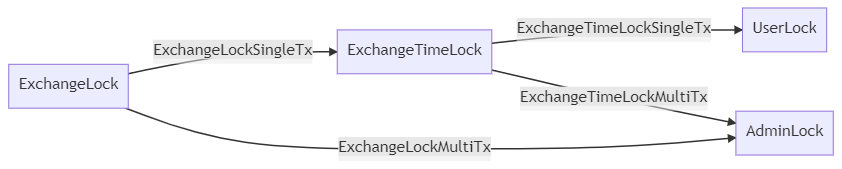

# Exchange-transaction-builder
Exchange-transaction-builder is used for building `ckb` transaction about `exchange lock script`.

The process is:



## Quick Start

```
$ git clone https://github.com/zzhengzhuo/exchange-transaction-builder.git
$ npm install
```
## Configure set
```js
// in `src/config.ts`

// the `exchange lock` dep cell info.`ExchangeLock` is a lock contract used for single signature as well as multiple signature
ckb_exchange_lock: {
    // the transaction hash
    txHash:'0x640cf49f57210110be256ddd16e885c125e3721fe13bd0987f225c16ccc8cfd2',
    // the transaction output index
    outputIndex: '0x0',
    // the type script hash
    typeHash:'0xe5e42c1fb347a0e2ffd5f5da4c564c472b8e71945167ad5a480047e5b66b821b',
},

// the `exchange timelock` dep cell info.`ExchangeTimeLock` is like `ExchangeLock` but with `since check` feature.
ckb_exchange_timelock: {
    // the transaction hash
    txHash:'0x342b5ed966bb299642310fe69562e6d33a6c4c229ab3b39a2ad187b81d862ed1',
    // the transaction output index
    outputIndex: '0x0',
    // the type script hash
    typeHash:'0x822dbe56e83d6eadb7915d63395f8d174015dbfce76e08494874fbac0dba3f21',
},
```

## Build ExchangeLockSingleTx

### Example
```typescript
const tx = await ExchangeLockSingleTx.create(   //create ExchangeLockSingleTx
    fromOutPoint:OutPoint,                  //OutPoint where NFT from
    userLockScript:Script,                  //lock script from User Lock                            
    threshold:number,                       //threshold for multiple signature               
    requestFirstN:number,                   //first nth public keys must match,for multiple signature
    singleSignPrivateKey:string,            //private key for single signature
    multiPubKey:string[],                   //public keys for multiple signature
    env:CKBEnv,                             //run environment:One of `dev`,`testnet`
);
const txHash = await tx.send();             //deploy transaction
```
### Quick Start
```bash
$ npm start deploy_tx ExchangeLockSingleTx --txHash [Your txHash] --txOutputIndex [Your txOutputIndex] --env [One of "dev","testnet"]
```
## Build ExchangeLockMultiTx

### Example
```typescript
const tx = await ExchangeLockMultiTx.create(   //create ExchangeLockSingleTx
    fromOutPoint:OutPoint,                  //OutPoint where NFT from
    adminLockScript:Script,                  //lock script from Admin Lock                            
    threshold:number,                       //threshold for multiple signature               
    requestFirstN:number,                   //first nth public keys must match,for multiple signature
    singlePubKey:string,                    //single key for single signature
    multiSignPrivateKey:string[],           //private keys for multiple signature
    env:CKBEnv,                             //run environment:One of `dev`,`testnet`
);
const txHash = await tx.send();             //deploy transaction
```
### Quick Start
```bash
$ npm start deploy_tx ExchangeLockMultiTx --txHash [Your txHash] --txOutputIndex [Your txOutputIndex] --env [One of "dev","testnet"]
```

## Build ExchangeTimeLockSingleTx

### Example
```typescript
const tx = await TimeLockSingleTx.create(   //create ExchangeTimeLockSingleTx
    fromOutPoint:OutPoint,                  //OutPoint where NFT from
    userLockScript:Script,                  //lock script from User Lock                            
    threshold:number,                       //threshold for multiple signature               
    requestFirstN:number,                   //first nth public keys must match,for multiple signature
    singleSignPrivateKey:string,            //private key for single signature
    multiPubKey:string[],                   //public keys for multiple signature
    env:CKBEnv,                             //run environment:One of `dev`,`testnet`
);
const txHash = await tx.send();             //deploy transaction
```
### Quick Start
```bash
$ npm start deploy_tx TimeLockSingleTx --txHash [Your txHash] --txOutputIndex [Your txOutputIndex] --env [One of "dev","testnet"]
```

## Build ExchangeTimeLockMultiTx

### Example
```typescript
const tx = await TimeLockMultiTx.create(   //create ExchangeTimeLockMultiTx
    fromOutPoint:OutPoint,                  //OutPoint where NFT from
    adminLockScript:Script,                 //lock script from Admin Lock
    userLockScript:Script,                  //lock script from User Lock                            
    threshold:number,                       //threshold for multiple signature               
    requestFirstN:number,                   //first nth public keys must match,for multiple signature
    singlePubKey:string,                    //public key for single signature
    multiSignPrivateKey:string[],           //private keys for multiple signature
    env:CKBEnv,                             //run environment:One of `dev`,`testnet`
);
const txHash = await tx.send();             //deploy transaction
```
### Quick Start
```bash
$ npm start deploy_tx TimeLockMultiTx --txHash [Your txHash] --txOutputIndex [Your txOutputIndex] --env [One of "dev","testnet"]
```

